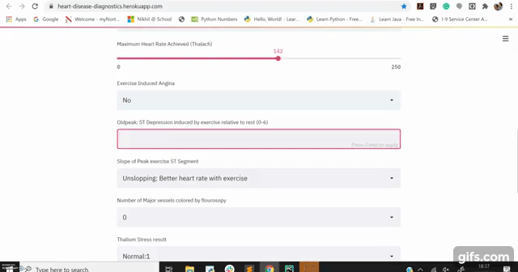

# Heart-Disease-Prediction

### Check out the Streamlit web app below - 
https://heart-disease-diagnostics.herokuapp.com/

## Problem Definition

***Given clinical parameters about a person, can we predict whether or not they have heart disease?***

### Features - 

1. ***age - age in years***
2. ***sex*** - (1 = male; 0 = female)***
3. ***cp - chest pain type***
    - 0: Typical angina: chest pain related decrease blood supply to the heart
    - 1: Atypical angina: chest pain not related to heart
    - 2: Non-anginal pain: typically esophageal spasms (non heart related)
    - 3: Asymptomatic: chest pain not showing signs of disease
4. ***trestbps - resting blood pressure*** (in mm Hg on admission to the hospital) anything above 130-140 is typically cause for concern
5. ***chol - serum cholestoral in mg/dl***
    - serum = LDL + HDL + .2 * triglycerides
    - above 200 is cause for concern
6. ***fbs - (fasting blood sugar > 120 mg/dl)*** (1 = true; 0 = false)56
    - '>126' mg/dL signals diabetes
    
    

7. ***restecg - resting electrocardiographic results***
    - 0: Nothing to note
    - 1: ST-T Wave abnormality
    - can range from mild symptoms to severe problems
    - signals non-normal heart beat
    - 2: Possible or definite left ventricular hypertrophy
    - Enlarged heart's main pumping chamber
8. ***thalach - maximum heart rate achieved***
9. ***exang - exercise induced angina*** (1 = yes; 0 = no)
10. ***oldpeak - ST depression induced by exercise*** relative to rest looks at stress of heart during excercise unhealthy heart will stress more
11. ***slope - the slope of the peak exercise ST segment***
    - 0: Upsloping: better heart rate with excercise (uncommon)
    - 1: Flatsloping: minimal change (typical healthy heart)
    - 2: Downslopins: signs of unhealthy heart
12. ***ca - number of major vessels (0-3) colored by flourosopy***
    - colored vessel means the doctor can see the blood passing through
    - the more blood movement the better (no clots)
13. ***thal - thalium stress result***
    - 1,3: normal
    - 6: fixed defect: used to be defect but ok now
    - 7: reversable defect: no proper blood movement when excercising
14. ***target - have disease or not*** (1=yes, 0=no) (= the predicted attribute)

## feature Selection & Inference Pipeline (Luigi)

***Based on the extensive feature selection*** and looking at all aspects of Training accuracy, Testing Accuracy, Precision & Recall, ***I have selected 3 different models*** as the best estimators. I got a ***Test accuracy of 88.5% and f1 score of 89%*** on all of these.

I have further created a Ensemble max voting of the predictions from these 3 models to bring more generalization to the final prediction.

***Max heart rate, Exercise induced Angina, Chest pain type and Major vessel counts*** seems to be most significant for Prediction of Heart Diseases.

I have developed a ***Inference pipeline too using luigi and deployed the Model as a service using Streamlit & Docker on Heroku***. 

